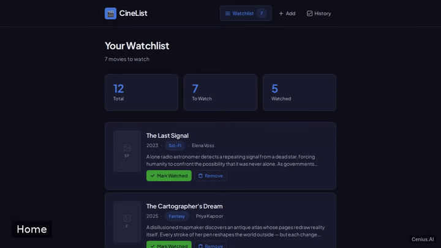
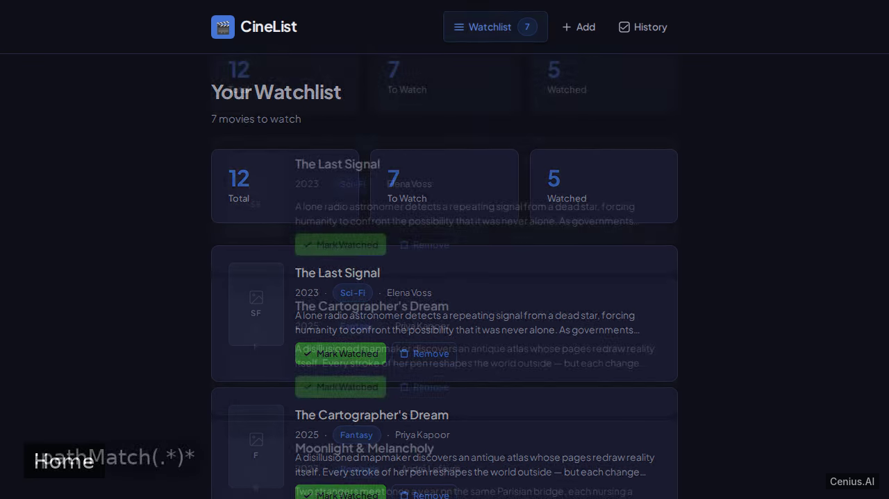
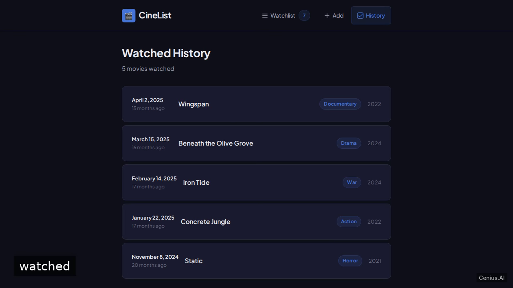

# Movie Watchlist SPA — complete Vite movie to-do list example app

Clone it. Run it. Own it. **Movie Watchlist SPA** is a complete, Apache-2.0-licensed movie to-do list app in Vite — full source, demo data included. A single-page application for managing a personal movie watchlist, built with Vue 3 and Vite. Self-host Movie Watchlist SPA on your own infrastructure, or open it on [cenius.ai](https://cenius.ai/marketplace/p/movie-watchlist-spa-2?ref=gh&utm_campaign=movie-watchlist-spa-vite) to request changes and get a Movie Watchlist SPA fresh build.


[](LICENSE)  [](https://cenius.ai)

[](https://cenius.ai/marketplace/p/movie-watchlist-spa-2?ref=gh&utm_campaign=movie-watchlist-spa-vite)

> **▶ [Open & edit in cenius.ai](https://cenius.ai/marketplace/p/movie-watchlist-spa-2?ref=gh&utm_campaign=movie-watchlist-spa-vite)** — one click to an editable workspace: describe changes in plain English, get an instant preview, one-click deploy and host. Modifications made on the platform come with full rebrand & relicense rights.

_Local clone? See [Quick start](#quick-start) below. cenius.ai is the zero-setup path._

## Demo



📽 **[Demo video on cenius.ai](https://cenius.ai/marketplace/p/movie-watchlist-spa-2?ref=gh&utm_campaign=movie-watchlist-spa-vite)** — the complete run-through · [MP4](.github/media/demo.mp4)

## Screenshots

  

## Features

- Watchlist page
- Movie detail page
- Add movie form
- Watched history page
- Seed demo movies
- LocalStorage persistence

## Quick start

```bash
./install.sh   # installs dependencies + seeds demo data
```

See [`INSTALL.md`](INSTALL.md) for full setup and usage instructions.

## Usage guide

After starting the development server (`npm run dev`), open `http://localhost:5173` in your browser. The app consists of four main pages:

### Pages

#### Watchlist (`/`)

Displays all movies you’ve added, with their title, genre, and release year. Each movie card includes a button to mark it as watched. The watchlist is initially populated with demo movies from `src/data/seed.js`.

#### Add a Movie (`/add`)

A form (`src/views/AddMoviePage.vue`) where you can enter a movie title, genre, and release year. Submitting the form adds the movie to the watchlist and navigates back to the home page.

#### Movie Details (`/movie/:id`)

Clicking on a movie in the watchlist takes you to its detail page (`src/views/MovieDetailPage.vue`). Here you can see all the information about the movie and a button to mark it as watched (if it isn’t already).

#### Watched History (`/watched`)

The history page (`src/views/WatchedHistoryPage.vue`) lists every movie you have marked as watched. From here you can revisit the movie’s details, or remove individual entries from the history.

### Data Persistence

All movie data is stored in the browser’s `localStorage` via a Pinia store (`src/stores/movies.js`). The app loads the demo seed data only when the store is empty, so your own additions and watched markers persist across browser sessions.

### Example Walkthrough

_Full guide: [`USAGE.md`](USAGE.md)_

## Architecture

Folder layout: `src/`. Kick off `./install.sh` to pull packages and seed the database, then the app is up. Built in Vite (32 files). For environment-specific setup, see [`INSTALL.md`](INSTALL.md).

## FAQ

### How do I get Movie Watchlist SPA running locally?

Pull the repo, run `./install.sh`, and you are up — the script installs packages and pre-seeds the database. [`INSTALL.md`](INSTALL.md) covers any platform-specific tweaks.

### What powers Movie Watchlist SPA under the hood?

The app is built with Vite. What you see in this repo is the full production source, demo data included. Highlights include localStorage persistence.

### What if I want to add features to Movie Watchlist SPA without coding?

Non-developers can use [cenius.ai](https://cenius.ai/marketplace/p/movie-watchlist-spa-2?ref=gh&utm_campaign=movie-watchlist-spa-vite) to make changes. Describe your goal in everyday language and the platform delivers an updated, ready-to-run project — zero coding on your part.

### Can I rebrand or white-label Movie Watchlist SPA?

Yes. The MIT license lets you remove the original branding and ship under your own name. For a guided approach, [remix it on cenius.ai](https://cenius.ai/marketplace/p/movie-watchlist-spa-2?ref=gh&utm_campaign=movie-watchlist-spa-vite): you get a fresh build with full rebrand and relicense rights.

### What license does Movie Watchlist SPA use?

Yes — it ships under the Apache-2.0 license, which permits commercial use, modification and redistribution. The full text is in [LICENSE](LICENSE).

## License & rebranding

Released under the [Apache License 2.0](LICENSE) (© 2026 Cenius AI) — free for personal and commercial use. The Cenius name/logo are trademarks (see NOTICE).

**Need a customized version?** [Remix this app on cenius.ai](https://cenius.ai/marketplace/p/movie-watchlist-spa-2?ref=gh&utm_campaign=movie-watchlist-spa-vite) — modifications made on the platform come with **full rebrand & relicense rights** over your derivative.

## Built with cenius.ai

This entire application — code, design, seeded demo data — was generated on **[cenius.ai](https://cenius.ai)** from a plain-English description.

- 🚀 [Build your own app on cenius.ai](https://cenius.ai)
- 🎛️ [Remix Movie Watchlist SPA on the marketplace](https://cenius.ai/marketplace/p/movie-watchlist-spa-2?ref=gh&utm_campaign=movie-watchlist-spa-vite) — open it in a workspace, prompt for changes, and ship your own version.

More open-source apps: [the Cenius-ai catalog](https://github.com/Cenius-ai) · [showcase index](https://github.com/Cenius-ai/showcase)
